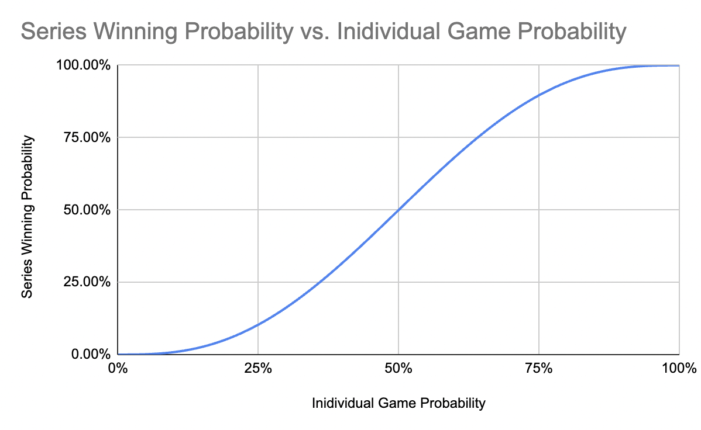
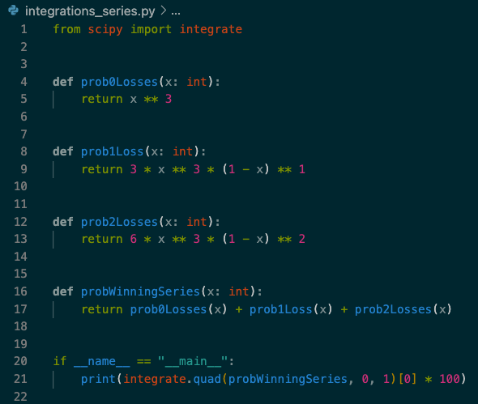

# You win some and you lose some

We go through life and events happen to us which we categorise as either a desirable or undesirable outcome. As the saying goes, _you win some and you lose some_.

As people it can feel natural to repeat actions that lead us to wins and conversely avoid actions that leads us to losses. But in a situation where we win or lose, how much of this result was due to our actions versus external factors outside of our control? Is a I would argue that luck plays a larger role than people are willing to admit.

## RNG vs G2 Worlds 2018 quarterfinals

This was an amazing upset where G2 eSports took down Chinese powerhouse and the tournament favourites RNG in a 5 game series. According to G2's captain Luka Perković the win was _"definitely unexpected right?"_ (see his post game interview [here](https://www.youtube.com/watch?v=IUawdY1-QRA)) but just how unexpected was it? From a narrative perspective, G2 was the 3rd best team from the 3rd best region and RNG was the best team from the best region. From that angle the upset was colossal. But what about from a statistical angle?

## Flipping a coin

To understand the calculation behind the probability of G2's series win, let's use a contrived example of flipping a coin 5 times. Over our flipping, what is the probability that it lands heads three times and tails twice? We need three things to calculate this:

1.   An assumption of independence

2.   The likelihood of achieving the individual result

3.   The number of ways the entire result can occur

Well for `1`, since the result of one flipped coin does not depend on the result of another, we can say these events are _independent_. This is a handy statement because it means we can multiply the probability of each event together to obtain the probability that all of those events will happen. For `2`, the likelihood of achieving heads is 50%. Lastly the number of ways we can flip 3 heads and 2 tails is 10.

So the probability of flipping heads three times is the probability of flipping heads once multiplied by itself three times which is `12.5%`. Similarly the probability of flipping tails twice is `25%`. So the probability of flipping three heads and then 2 tails is `3.125%`. But these heads and tails combinations can occur in 10 different ways so we have to multiply this number by 10 and we get a `31.25%` chance of flipping three heads and 2 tails.

## Probability of winning a series

In professional League of Legends a _series_ is played over 5 individual _games_ and the first team to win 3 games wins the series. G2 won their series against RNG with 3 wins and 2 losses. Let's apply the same logic as before to calculate the likelihood of this happening.

For `1`, let's assume independence by saying that whether a team lost or won a game does not affect their performance in the ensuing game. This is definitely a questionable assumption but let's make it anyway so that we can carry on with the calculation. For `2`, let's assume that G2 would on average win 20% of their games against RNG. This is of course a complete guess but assigning a value will help us get a feel for the calculation. For `3`, there are actually less combinations since if G2 wins 3 in a row, then the series is over and we do not reach a 5 game series. There are 6 combinations that G2 can win 3 games and lose 2 in a series.

Putting all of this together, G2 has a 12.29% chance of beating RNG. That seems rather high? Even though we assumed RNG would win 80% of their games against G2, there is a 12.29% chance that G2 wins in a best of 5 series. More generally, if there is ever a series where one team has a 80% likelihood of winning a single game, we would statistically expect the underdog to win around 1 in every 8 series. In my opinion, that's actually not that uncommon despite the colossal mismatch in win-rate!

One thing that sits funny in that previous calculation is the assumption that G2 had a 20% win-rate against RNG. This number is purely theoretical and we can never know without lots of data samples that just don't exist. This could have easily have been a number like 5%. Assuming this gives G2 only a 0.12% chance of winning the series which is more in-line with the narrative going into the series.

## What does a series win even tell us?

So depending on our estimate for G2's theoretical win-rate, the statistical probability of their series win becomes drastically different. So what can we even derive about a team if they win a series?

Let's ask ourselves the question: _given that a team wins a series, what is the probability that they are actually a better team than their opponents?_ let's define a _better team_ as a team that has a higher theoretical win-rate than their opponent.

We calculated the probability of a series win using 2 arbitrary values 20% and 5%, but what does this probability look across all possible theoretical win-rates?

The graph above shows the probability that a team with a `x%` win-rate will win a series in any combination (0 losses, 1 loss or 2 losses).

To answer our question, we're interesting in the values on the x-axis that are greater than 50%. The probability that a team with a higher win-rate wins a series is the area under the curve between 50% and 100%. We can calculate the area by integrating under the curve. Because I haven't integrated since university and I lost my ability to write well before then, let's use a python script to get the area:

This yields a probability of `42.19%`. Note that this can be verified using bayesian methods but I want to talk about that in a different article and won't go into it here.

## Emulating success

<!-- STARTHERE: Does this make sense? Given 2 teams, there is a 50% chance that your team is better than its opponent. How does this decrease after a series win? -->
<!-- ANSWER: Because there is a ~8% chance that you were a worse team but still won -->

So if a team wins a series, there is a `42.19%` chance that they have a higher theoretical win-rate and therefore are a better team.

This includes any combination of a series win. If we narrow this down to a series win where the winner lost 2 games, then there is only a `6.56%` chance that this team is better than their opponents!

This is interesting because the last 3 international League of Legends Finals (MSI 2021, Worlds 2021, MSI 2021) were all won in a 3-2 game series. Teams all around the world would look towards these winners and copy their strategies, training schedules and drafts in an attempt to replicate their success. But from _one_ series win, we can only derive a 6.56% chance that the winner is actually the superior team so is emulating their actions really going to result in success for yourself?

## Take aways

Talking about League of Legends is interesting but there's a message to take away here about what we can derive from our wins and losses in general.

Maybe you didn't get that promotion, maybe you didn't get invited to that party or maybe that love interest doesn't find you funny. It's quite common for these sorts of losses to lead to severe introspection and leave you anxious and keen to uproot all of your current behaviours in pursuit of a win. If you end up in a spiral like this, think about RNG's loss to G2 and keep in mind that there's a chance that your loss was just a result of daily randomness and doesn't prove that all of your life actions have been wrong and will not lead you to a win. As the saying goes, _you win some and you lose some_.
