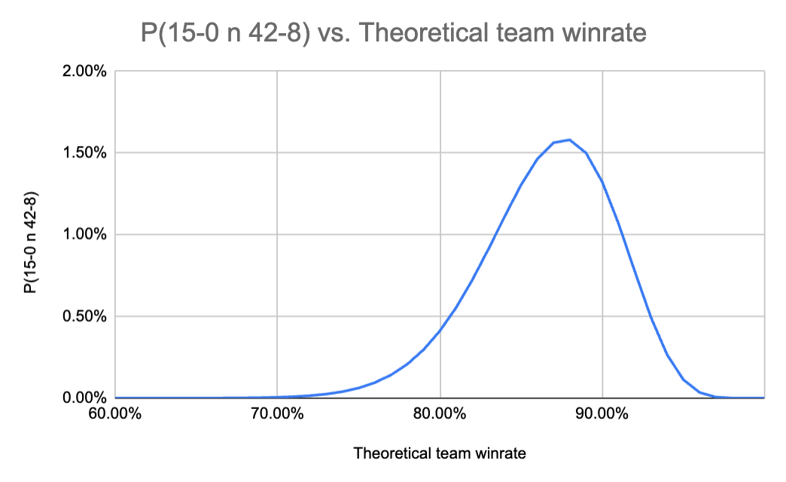

# The Better Team

What's a more impressive scoreline for a team, 15-0 or 42-8?

## Motivation

In April 2022, the E-Sports League of Legends Team T1 had an "undefeated" split where they won [18 series in a row](https://lol.fandom.com/wiki/LCK/2022_Season/Spring_Season) to be crowned the League of Legends Champions Korea (LCK) Sprint Split 2022 champions. I say _undefeated_ in quotation marks because while T1 was undefeated across each series, a series is played as a best-of-three game set meaning T1 can lose _games_ but still win the _series_. And in fact they did lose games. T1's game record at the end of their undefeated series season was 42 wins and 8 losses.

T1's 2022 performance was met with a lot of praise and analysts believed they were the best team in the world at that time. Some people however, liked to tunnel on the fact that T1 had a literal undefeated split back in 2014.

This is a quote from Phreak on the JLXP podcast:

<!-- TODO: reference the exact podcast -->

> I just want to stipulate that they had an _actual_ undefeated season.
>
> They are undefeated in matches, that is true. It is an undefeated season through that lens I just... You know, "historic undefeated season", they had an actual lossless season is all I'm kind of saying; there's a different version of this that is even more impressive.
>
> They did something that I would argue is more impressive before.
>
> Let's say your chance to win every game is 90 / 10, you don't go 15-0. If your chance to win every game is 84%, this (meaning the 42-8 record) is your scoreline.
>
> Their level of domination was even higher, to me.

In 2014, T1 (branded as SKT) participated in the [Champions 2014 Winter](https://lol.fandom.com/wiki/Champions/2014_Season/Winter_Season) and won 15 _games_ to win the tournament.

Phreak raises a good point. T1 did actually have an undefeated season back in 2014. But is this actually more impressive than their 42-8 record from 2022?

I would argue: maybe.

## Probability rule of product

When Phreak says _"let's say your chance to win every game is 90 / 10, you don't go 15-0"_ this is actually incorrect. In probability, if you know the likelihood of event A occurring and the likelihood of event B occurring, then you can calculate the likelihood of event A _and_ B occurring by multiplying the two probabilities together, assuming the two events are independent. By "independent" I mean the outcome of event A does not affect the outcome of event B and vice-versa. This is known as the [rule of product](https://brilliant.org/wiki/probability-rule-of-product/).

So if your chance to win each game is 90%, then assuming your performance of each current game is not affected by your previous games, we can calculate the probability of winning 15 games in a row by multiplying 0.9 by itself 15 times which is 20.6%. Pretty interesting, right? Even though your team's theoretical win rate was 90%, you only have a 20.6% chance of having a 100% win rate on your record across 15 games.

Ok, let's say your team has a 90% theoretical win rate but you play 50 games just as T1 did in 2022 Spring. What is the probability of also having a 100% win rate on your record? Well just as before we know the likelihood of winning a game is 90% so assuming the outcome of each game is independent of the previous games, we just multiply 0.9 by itself 50 times which comes out to 0.515%. So it is much less likely for a team with the exact same theoretical win-rate to maintain a scoreline of 100% across 50 games than it is 15.

This is the crux of what I want to argue. It is harder for a team to maintain the same scoreline across a larger sample of games. The question is, does the larger sample size of T1's 2022 Spring make it a more impressive than their Champions 2014 Winter result, despite the lower scoreline?

## Quantifying impressiveness

To try and quantify the term _more impressive_, let's assume that the team with a higher theoretical win rate is the more impressive one. Of course, we can never know the actual theoretical win rate of a team. But for each theoretical win-rate (0% - 100%) _x_, we can calculate the probability that this team achieves a 15-0 result and a 42-8 result. Then, with these values, we can calculate how likely it is that team _x_ goes 15-0 and 42-8. Or in other words, the probability that a team who goes 15-0 and a team who goes 42-8 has the same theoretical win-rate _x_.

To get a feel for the calculation we're doing, let's start at the extremes:

> If a team has a 100% theoretical win-rate, what is the probability that they achieve a result of:
>
> i. 15-0
> ii. 42-8

Well for _i_ we know the answer is 100% since a team with a 100% theoretical win-rate has a 100% chance of winning every game. Similarly for _ii_ we know the answer is 0% since a team with a 100% win-rate cannot lose 8 games. So what is the probability that a 100% theoretical win-rate team goes 15-0 and 42-8? Using the rule of product and making our assumption of independence, 100% times 0% is 0%. So there is a 0% chance that both teams had a theoretical win-rate of 100%.

Ok, now let's move to a more realistic example:

> If a team has a 84% theoretical win-rate, what is the probability that they achieve a result of:
>
> i. 15-0
> ii. 42-8

Using the rule of product (and making our assumptions of independence of course) we know the answer to _i_ is 7.31%. For _ii_ it's a bit trickier. So we know this team has a 84% chance of winning and therefore a 0.066% chance of gaining 42 wins. We can also reason that this team has a 16% chance of losing and therefore has a 0.000043% chance of gaining 8 losses. Once again using the rule of product and making our assumption of independence, we can calculate that the probability of a 84% theoretical win-rate team going 42-8 is 0.0000028%.

"But wait!", you might say. A 42-8 record means that you won 84% of your games, so why is it that the probability of a 84% theoretical win-rate team has such a small likelihood of going 42-8?

Well what we really calculated was the probability that this team goes 42-8 for a single combination of wins and losses. There are lots of different ways a team can go 42-8. They can win 42 games in a row and then lose the remaining 8, or they can lose the first 8 and win the remaining 42. But how many ways are there? It turns out there are 536,878,650.

If there are 536,878,650 different combinations to yield a 42-8 score line and the probability of each of these is 0.0000028%, then probability that a 84% theoretical win-rate team goes 42-8 in any combination is 15.23% (536,878,650 x 0.0000028%). See [binomial theorem](https://en.wikipedia.org/wiki/Binomial_theorem) to learn more about this type of calculation.

So there is a 1.11% chance that 2014 SKT and 2022 SKT had the same theoretical win-rate of 84%.

## Putting it all together

We've calculated the probability that 2014 T1 and 2022 T1 have the same theoretical win-rate of 100% and 84%. But what about all of the other theoretical win-rates?

We can put the calculations we performed above into a single equation dependent on the theoretical win-rate _x_:

If you set _x_ equal to 100% then this equation will return 0% and if you set _x_ equal to 84% then this equation will return 1.11%, just as we calculated above.

Now let's plot this equation for all possible values of _x_.

Ok so now we have a graph containing the probability that a team who goes 15-0 and another who goes 42-8 have the same theoretical win-rate, for all possible theoretical win-rates _x_.

To find the probability that 2014 T1 and 2022 T1 had the same theoretical win-rates, we need to find the area under the curve. Or in other words we need to integrate this equation between 0% and 100%.

This is a long calculation but I've put it in a Google Sheet doc here, along with other calculations for this article.

The result of this calculation is X%. So there is a X% chance that 2014 T1 and 2022 T1 had the exact same theoretical win-rate meaning no team is more impressive or more dominant than the other.

## An extension

We can extend this calculation except rather than calculating the probability that the two teams have the same theoretical win-rate, we can calculate the probability that 2022 T1 has the same or higher theoretical win-rate than 2014 T1.

We use the same reasoning that we applied previously but instead of asking for a theoretical win-rate _x_, what is the probability that this team goes 42-8, we ask **for all** win-rates _x_ or higher, what is the probability that this team goes 42-8.

This can be modelled by the equation:

And to find our final value, we need to integrate this between 100% and 0%. This yields us Y%.

## Conclusions

There is a Y% chance that 2022 T1 has the same or higher theoretical win-rate than the 2014 T1. This is why I would refute Phreak's argument with a maybe.

I like Phreak as an analyst. He often has nuanced takes about strategy that originate from thought and calculations. Sometimes however, he has these opinions that he repeats and argues without his usual level of analysis and seemingly wants to die on these hills.

The purpose of this article is to call Phreak out and encourage him to at least re-assess his certainty that the 2014 T1's scoreline was more impressive than this year's T1's scoreline.

I'm sure Phreak will never read this but it was interesting trying to quantify a team's level of dominance based on two different scorelines. I hope there are some readers out there who found it interesting as well.
